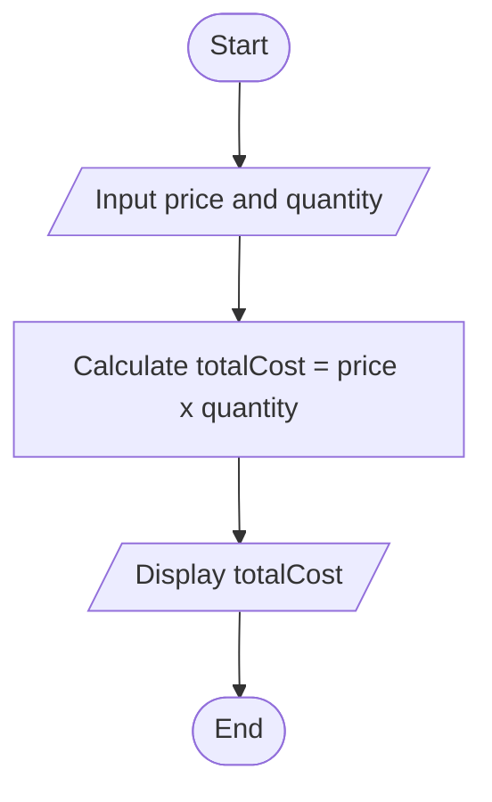
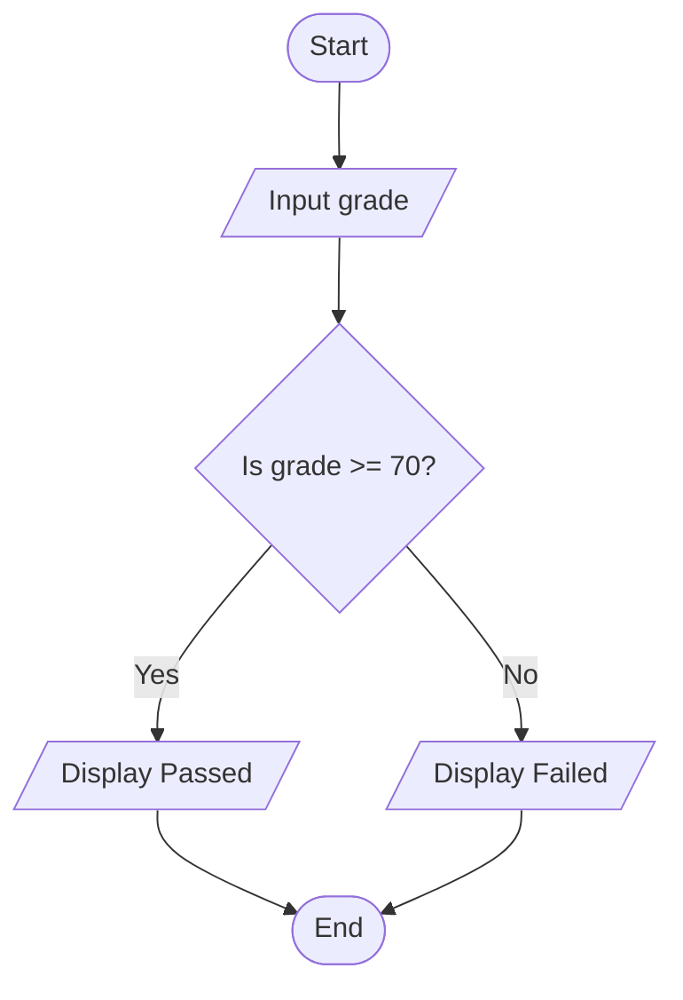

# Programming Logic and Design

## Lecture 2: Flowchart and Pseudocode Basics

> **Main idea:** A logical solution must be represented clearly before it can be translated into a computer program.

---

## Learning Outcomes

At the end of this lecture, students should be able to:

1. Review the relationship among problems, problem-solving, and algorithms.
2. Identify the essential characteristics of a good algorithm.
3. Explain the purpose of pseudocode and flowcharts.
4. Apply basic pseudocode conventions.
5. Identify and correctly use standard flowchart symbols.
6. Translate a simple algorithm into pseudocode and a flowchart.
7. Check whether pseudocode and a flowchart represent the same logic.

---

# 1. Review: From Problem to Program

## What is a problem?

A **problem** is a situation in which there is a difference between the present condition and a desired result.

In programming, a problem usually describes:

- What needs to be accomplished
- What information is available
- What result is expected
- What rules or limitations must be followed

### Example

> A student wants to determine whether a weekly allowance is enough to cover transportation and food expenses for five school days.

The desired result is not simply a number. The student also wants to know whether the budget is sufficient.

---

## What is problem-solving?

**Problem-solving** is the process of understanding a problem and developing a logical solution.

A simplified problem-solving process is:

```text
1. Understand the problem.
2. Identify the required inputs and outputs.
3. Determine the necessary processing.
4. Design the algorithm.
5. Represent the algorithm.
6. Check the solution.
7. Implement it as a program.
```

### Relatable analogy: Planning a trip

- The **destination** is the expected result.
- Your **starting point** is the available input.
- The **route** is the algorithm.
- A **map** represents the planned solution.
- Driving the route is similar to executing the program.

Starting to code without understanding the problem is like driving without knowing the destination.

---

## From a problem to a program

```text
Problem
   ↓
Problem analysis
   ↓
Logical solution
   ↓
Algorithm
   ↓
Pseudocode or flowchart
   ↓
Program
```

In this lecture, our main focus is the step between the **algorithm** and the **program**.

---

# 2. Brief Review: Input-Process-Output

The **Input-Process-Output**, or **IPO**, model helps identify the essential parts of a problem.

| Part    | Guiding question                 |
| ------- | -------------------------------- |
| Input   | What data is needed?             |
| Process | What must be done with the data? |
| Output  | What result must be produced?    |

## Example: Daily transportation cost

### Problem

Calculate a student's transportation expense for several school days.

| Input                                               | Process                                       | Output                       |
| --------------------------------------------------- | --------------------------------------------- | ---------------------------- |
| Daily transportation cost and number of school days | Multiply the daily cost by the number of days | Total transportation expense |

```text
totalExpense = dailyCost × numberOfDays
```

The IPO table helps us determine which instructions must appear in the algorithm.

---

# 3. Review: Algorithms

## What is an algorithm?

An **algorithm** is a finite and ordered set of clear instructions for solving a problem or completing a task.

An algorithm describes the solution before it is written in a specific programming language.

### Relatable analogy: A recipe

- Ingredients are the **inputs**.
- Cooking steps are the **processing**.
- The prepared dish is the **output**.
- Cooking time and temperature are the **rules or constraints**.

If the steps are incomplete, unclear, or incorrectly ordered, the result may not be what was intended.

---

## Example algorithm: Notebook purchase

### Problem

Calculate the total cost of several notebooks.

```text
1. Get the price of one notebook.
2. Get the number of notebooks.
3. Multiply the price by the quantity.
4. Display the total cost.
5. Stop.
```

---

## Characteristics of a good algorithm

### Clear

Every instruction must be understandable.

```text
Unclear: Process the grades.
Clear: Add the three grades and divide the total by 3.
```

### Unambiguous

Each instruction must have only one reasonable interpretation.

```text
Ambiguous: Add some water.
Unambiguous: Add 200 milliliters of water.
```

### Ordered

Instructions must appear in the correct sequence. A result cannot be displayed before it is calculated.

### Finite

The algorithm must eventually stop or reach a defined operating state.

### Correct

It must produce the expected result when valid data is provided.

### Effective

Every instruction must be possible to perform.

### Has defined inputs and outputs

The required data and expected result must be identifiable.

### Testable

The algorithm must be checkable using sample values.

> A good algorithm is clear enough to be represented using pseudocode or a flowchart without changing its logic.

---

# 4. Representing an Algorithm

An algorithm may be represented in different ways.

| Representation   | Form                               | Main advantage                  |
| ---------------- | ---------------------------------- | ------------------------------- |
| Natural language | Sentences or numbered instructions | Familiar and easy to begin with |
| Pseudocode       | Structured text                    | Easy to translate into code     |
| Flowchart        | Standard symbols and arrows        | Makes program flow visible      |

These representations may look different, but they should describe the **same solution**.

---

## One solution in three forms

### Problem

Calculate the area of a rectangle.

### Natural-language algorithm

```text
1. Get the length.
2. Get the width.
3. Multiply the length by the width.
4. Display the area.
5. Stop.
```

### Pseudocode

```text
START
    INPUT length
    INPUT width
    area = length × width
    DISPLAY area
END
```

### Flowchart structure

```text
Start
  ↓
Input length and width
  ↓
Calculate area = length × width
  ↓
Display area
  ↓
End
```

---

# 5. Pseudocode Basics

## What is pseudocode?

**Pseudocode** is a structured, human-readable, and language-independent description of an algorithm.

It resembles programming code, but it does not follow the exact syntax of C or another programming language.

### Relatable analogy: A construction plan

A construction plan is not the finished building. It organizes the design so workers understand what must be built.

In the same way, pseudocode is not an executable program. It organizes the logic so a programmer understands what code must be written.

---

## Why use pseudocode?

- It focuses attention on logic instead of syntax.
- It organizes instructions before coding.
- It makes missing or incorrectly ordered steps easier to find.
- It is easier to revise than source code.
- It communicates a solution without requiring a specific programming language.
- It provides a guide when the algorithm is implemented.

---

## Basic pseudocode operations

### Start and end

```text
START
    instructions
END
```

### Input

```text
INPUT length
INPUT width
```

### Processing or assignment

```text
area = length × width
totalCost = price × quantity
```

The symbol `=` means that the calculated value is assigned to the name on the left.

### Output

```text
DISPLAY area
DISPLAY "Transaction successful"
```

### Simple decision

```text
IF grade >= 70
    DISPLAY "Passed"
ELSE
    DISPLAY "Failed"
END IF
```

The detailed programming of conditional statements will be discussed in a later lesson. For now, focus on representing the decision clearly.

---

## Pseudocode conventions

- Begin with `START` and finish with `END`.
- Write one action per line.
- Use clear action words such as `INPUT`, `DISPLAY`, and `CALCULATE`.
- Use meaningful names such as `totalCost` instead of unclear names such as `x`.
- Capitalize keywords consistently.
- Indent instructions inside decisions.
- Arrange instructions in the correct order.
- Avoid unnecessary C syntax such as semicolons, braces, and format specifiers.
- Keep the solution readable and consistent.

---

## Example 1: Calculate an average

```text
START
    INPUT score1
    INPUT score2
    INPUT score3
    total = score1 + score2 + score3
    average = total / 3
    DISPLAY average
END
```

---

## Example 2: Mobile-load purchase

### Problem

Determine whether a customer's balance is sufficient to purchase mobile load.

```text
START
    INPUT balance
    INPUT loadAmount

    IF balance >= loadAmount
        newBalance = balance - loadAmount
        DISPLAY "Purchase successful"
        DISPLAY newBalance
    ELSE
        DISPLAY "Insufficient balance"
    END IF
END
```

The indentation makes the two possible paths easier to recognize.

---

## Common pseudocode mistakes

### Using vague instructions

```text
Process the values.
```

The required operation is not defined.

### Using inconsistent keywords

Using `READ`, `GET`, `ACCEPT`, and `INPUT` for the same operation may confuse the reader. Select one convention and use it consistently.

### Writing source-code syntax

Pseudocode should express logic without requiring the exact rules of C.

### Missing an output

An algorithm may calculate the correct result but fail to display it.

### Incorrect ordering

A value is used before it is received or calculated.

---

# 6. Flowchart Basics

## What is a flowchart?

A **flowchart** is a graphical representation of an algorithm. It uses standard symbols connected by arrows to show the order of operations and possible paths.

### Relatable analogy: A road map

- Symbols represent locations or actions.
- Arrows represent the roads connecting them.
- A decision symbol is an intersection.
- The answer to the condition determines which road to follow.

---

## Why use a flowchart?

- It makes the sequence of operations visible.
- It clearly shows decisions and possible paths.
- It helps reveal missing or incorrectly connected steps.
- It communicates program logic visually.
- It serves as a guide before coding.

---

## Standard flowchart symbols

| Symbol       | Shape         | Purpose                           | Example content            |
| ------------ | ------------- | --------------------------------- | -------------------------- |
| Terminal     | Oval          | Marks the beginning or end        | Start, End                 |
| Input/Output | Parallelogram | Receives or displays data         | Input grade, Display total |
| Process      | Rectangle     | Performs an action or calculation | `total = price × quantity` |
| Decision     | Diamond       | Evaluates a condition             | `grade >= 70?`             |
| Flow line    | Arrow         | Shows the direction of execution  | From one symbol to another |
| Connector    | Circle        | Connects separated parts          | A, B, or another label     |

---

## Flowchart rules

- Begin with a **Start** terminal.
- Finish with an **End** terminal.
- Connect symbols using directional arrows.
- Arrange the flow from top to bottom or left to right when possible.
- Use a parallelogram for input and output.
- Use a rectangle for calculations and actions.
- Place a question or condition inside a decision diamond.
- Label decision branches `Yes/No` or `True/False`.
- Make sure every decision branch has a destination.
- Avoid crossing flow lines when possible.
- Keep the text inside each symbol short and clear.
- Use connectors only when they improve readability.

---

## Sequence flowchart example

### Problem

Calculate the total cost of an item.



The instructions follow a straight sequence from start to end.

---

## Decision flowchart example

### Problem

Determine whether a student passed. The passing grade is 70.



The diamond creates two possible paths. Only one path is followed for a particular grade.

---

## Common flowchart mistakes

- Using the wrong symbol for an operation
- Forgetting the Start or End symbol
- Drawing symbols without connecting arrows
- Leaving a decision branch unlabeled
- Creating a decision branch with no destination
- Allowing arrows to point in an unclear direction
- Placing too much text inside a symbol
- Making the flowchart logic different from the pseudocode

---

# 7. Translating Between Representations

The main skill for this lecture is translating the **same logic** from one representation to another.

## Recommended procedure

```text
1. Read and understand the given problem or algorithm.
2. Identify the start and end.
3. Identify all inputs.
4. Identify calculations and actions.
5. Identify all outputs.
6. Identify any condition or decision.
7. Write the pseudocode.
8. Draw the corresponding flowchart.
9. Compare the two representations.
```

---

## Worked example: Student pass or fail

### Problem

Determine whether a student passed. The passing grade is 70.

### IPO

| Input         | Process                   | Output           |
| ------------- | ------------------------- | ---------------- |
| Student grade | Compare the grade with 70 | Passed or Failed |

### Natural-language algorithm

```text
1. Get the student grade.
2. Compare the grade with 70.
3. If the grade is at least 70, display "Passed."
4. Otherwise, display "Failed."
5. Stop.
```

### Pseudocode

```text
START
    INPUT grade

    IF grade >= 70
        DISPLAY "Passed"
    ELSE
        DISPLAY "Failed"
    END IF
END
```

### Flowchart


### Consistency check

- Both representations receive the same input.
- Both use `grade >= 70` as the condition.
- Both produce the same possible outputs.
- Neither contains an extra or missing operation.

---

# 8. Checking the Logic and Format

Before submitting pseudocode or a flowchart, check the following.

## Logic checklist

- Is every required input present?
- Is every required calculation included?
- Are the instructions correctly ordered?
- Is the result displayed?
- Does each decision include all necessary paths?
- Does the solution reach an end?
- Do the pseudocode and flowchart represent the same solution?

## Pseudocode-format checklist

- Are the keywords used consistently?
- Is there one action per line?
- Are meaningful names used?
- Are decision instructions indented?
- Is unnecessary C syntax avoided?

## Flowchart-format checklist

- Are the correct symbols used?
- Are all symbols connected?
- Do the arrows show a clear direction?
- Are decision branches labeled?
- Do all branches have a destination?
- Is the flowchart clean and readable?

---

# 9. Guided Exercises

## Exercise 1: Algorithm to pseudocode

Write pseudocode for the following problem:

> Receive the price and quantity of an item, calculate the total cost, and display the result.

---

## Exercise 2: Pseudocode to flowchart

Draw the corresponding flowchart.

```text
START
    INPUT temperature

    IF temperature > 30
        DISPLAY "Turn fan on"
    ELSE
        DISPLAY "Keep fan off"
    END IF
END
```

---

## Exercise 3: Flowchart to pseudocode

Create pseudocode from a flowchart that performs these operations:

```text
Start
  ↓
Input two numbers
  ↓
Add the two numbers
  ↓
Display the sum
  ↓
End
```

---

## Exercise 4: Find the mismatch

The pseudocode calculates:

```text
totalCost = price × quantity
```

The corresponding flowchart contains:

```text
totalCost = price + quantity
```

Identify which representation is incorrect and revise it so both express the intended logic.

---

# 10. Individual Activity: Pseudocode and Flowchart Conversion

## Task

Choose one simple program from the following:

- Daily allowance calculator
- Electricity-usage checker
- Mobile-load purchase checker
- Classroom attendance checker
- Water-level controller

Submit:

1. A short problem statement
2. An IPO table
3. Pseudocode representing the complete solution
4. A corresponding flowchart

Your pseudocode and flowchart must contain the same inputs, processing, decisions, and outputs.

---

# 11. Summary

- A problem describes a present condition and a desired result.
- Problem-solving develops a logical solution before implementation.
- IPO analysis identifies the data, processing, and expected result.
- An algorithm is a clear, ordered, finite, and testable solution.
- Natural language, pseudocode, and flowcharts can represent an algorithm.
- Pseudocode expresses an algorithm through structured text.
- A flowchart expresses an algorithm using symbols and arrows.
- Correct logic and consistent formatting are both important.
- Pseudocode and its corresponding flowchart must describe the same solution.

---
